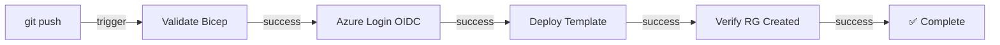
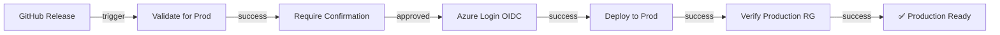

# Azure Test - Managed Identity Deployment Guide

## Overview

This repository demonstrates how to deploy Azure resources using **Managed Identity** with **GitHub Actions OIDC** authentication for a **private repository**.

### Key Features

✅ **Zero Passwords** - No client secrets stored  
✅ **OIDC Authentication** - Cryptographically signed tokens  
✅ **Managed Identity** - Azure-managed digital identity  
✅ **Bicep IaC** - Infrastructure as Code templates  
✅ **Multi-Environment** - Dev, Staging, and Production  
✅ **Audit Trail** - Complete tracking of deployments  

---

## Architecture

### Authentication Flow

```
GitHub Actions
     │
     ├─ Generate OIDC Token (GitHub signs)
     │
     ▼
Azure AD
     ├─ Validate GitHub signature ✅
     ├─ Look up Managed Identity
     ├─ Check role assignments
     │
     ▼
Azure Resource Manager
     ├─ Verify authorization
     ├─ Create Resource Group
     └─ Tag with audit trail
```

### What is Managed Identity?

A **Managed Identity** is a digital identity in Azure that:
- ✅ Has no passwords
- ✅ Is automatically created by Azure
- ✅ Is automatically rotated by Azure
- ✅ Has cryptographic certificates (Azure-managed)
- ✅ Can be assigned roles and permissions

---

## Prerequisites

### Azure Setup

1. **Azure Subscription**
   ```bash
   az account show --query id -o tsv
   ```

2. **Get Tenant ID**
   ```bash
   az account show --query tenantId -o tsv
   ```

3. **Create Managed Identity** (Optional - Template can create it)
   ```bash
   az identity create \
     --name uami-azure-test-deploy \
     --resource-group <existing-rg>
   ```

4. **Get Managed Identity Details**
   ```bash
   az identity list --query "[].{name:name, clientId:clientId, principalId:principalId}"
   ```

### GitHub Setup

1. **Make Repository Private**
   - Settings → General → Change Visibility → Private

2. **Create Personal Access Token (PAT)**
   - Settings → Developer Settings → Personal Access Tokens
   - Scopes: `repo`, `workflow`, `read:org`

3. **Add Repository Secrets**
   - Settings → Secrets and Variables → Actions
   
   ```
   AZURE_SUBSCRIPTION_ID  = <your-subscription-id>
   AZURE_TENANT_ID        = <your-tenant-id>
   AZURE_CLIENT_ID        = <managed-identity-client-id>
   ```

4. **Configure OIDC Trust** (In Azure AD)
   ```bash
   # Create federated credential
   az ad app federated-credential create \
     --id <app-object-id> \
     --parameters '{
       "name": "github-actions",
       "issuer": "https://token.actions.githubusercontent.com",
       "subject": "repo:GeitRavi/azure-test:ref:refs/heads/main",
       "audiences": ["https://management.azure.com"]
     }'
   ```

---

## Repository Structure

```
azure-test/
├── .github/
│   └── workflows/
│       ├── deploy-dev.yml              # Dev deployment automation
│       ├── deploy-prod.yml             # Prod deployment automation
│       └── test-all-environments.yml   # PR validation
│
├── src/
│   ├── rg/
│   │   ├── main-rg.bicep               # Main template with Managed Identity
│   │   ├── parameters-dev.json         # Dev parameters
│   │   └── parameters-prod.json        # Prod parameters
│   └── ...
│
├── module/
│   └── bicep/
│       └── resource-group.bicep        # RG module template
│
└── README.md
```

---

## How Managed Identity Creates Resource Groups

### Step 1: Bicep Template Creates Managed Identity

```bicep
resource userManagedIdentity 'Microsoft.ManagedIdentity/userAssignedIdentities@2023-01-31' = {
  name: 'uami-${resourceGroupName}-${environment}-deploy'
  location: location
  
  tags: {
    environment: environment
    deployedFrom: '${gitHubRepoOwner}/${gitHubRepoName}'
  }
}
```

### Step 2: GitHub Actions Authenticates Using OIDC

```yaml
- name: Azure Login via OIDC
  uses: azure/login@v1
  with:
    client-id: ${{ secrets.AZURE_CLIENT_ID }}
    tenant-id: ${{ secrets.AZURE_TENANT_ID }}
    subscription-id: ${{ secrets.AZURE_SUBSCRIPTION_ID }}
```

### Step 3: Managed Identity Deploys Resources

```bash
az deployment group create \
  --template-file src/rg/main-rg.bicep \
  --parameters @src/rg/parameters-dev.json
```

### Step 4: Authorization Check

Azure verifies:
- ✅ Managed Identity has "Contributor" role
- ✅ Permissions grant access to create RGs
- ✅ Deployment is allowed

### Step 5: Resource Group Created

Resource Group created with tags for audit trail:
```
Name: rg-azure-test-dev
Location: eastus
Tags:
  - environment: dev
  - deployedFrom: GeitRavi/azure-test
  - managedIdentity: uami-azure-test-deploy
  - createdBy: Managed Identity
```

---

## Deployment Workflows

### Development Deployment (Automatic)

**Trigger:** Push to `main` branch with changes in `src/rg/**` or `module/bicep/**`



### Production Deployment (Manual)

**Trigger:** GitHub Release creation or manual workflow dispatch



### Pull Request Validation (Matrix Test)

**Trigger:** Pull request with changes in `src/rg/**`

Tests all environments without deploying:
- ✅ Dev environment validation
- ✅ Staging environment validation
- ✅ Prod environment validation

---

## Bicep Template Guide

### Main Template (src/rg/main-rg.bicep)

**Parameters:**
```bicep
@param resourceGroupName    - Name of resource group
@param location             - Azure region
@param environment          - Deployment environment (dev/staging/prod)
@param gitHubRepoOwner      - Repository owner for audit
@param gitHubRepoName       - Repository name for audit
@param deploymentTimestamp  - Deployment time for tracking
```

**Resources Created:**
```
✅ Managed Identity (userAssignedIdentities)
   - Used for all subsequent deployments
   - Has role assignments for automation

✅ Resource Group (resourceGroups)
   - Tagged with audit information
   - Ownership tracked to Managed Identity
```

**Outputs:**
```bicep
output managedIdentityId          - For reference in other templates
output managedIdentityPrincipalId - For role assignments
output resourceGroupName          - For verification
```

### Module Template (module/bicep/resource-group.bicep)

**Resources:**
```bicep
resource rg 'Microsoft.Resources/resourceGroups@2021-04-01'
  - Creates the actual resource group
  - Applies comprehensive tags for tracking
  - Outputs RG details
```

---

## Environment Parameters

### Development (parameters-dev.json)

```json
{
  "resourceGroupName": "rg-azure-test-dev",
  "location": "eastus",
  "environment": "dev"
}
```

### Production (parameters-prod.json)

```json
{
  "resourceGroupName": "rg-azure-test-prod",
  "location": "eastus",
  "environment": "prod"
}
```

---

## Testing Deployments

### Manual Trigger (Development)

1. Go to **Actions** tab
2. Select **Deploy to Azure (Development)**
3. Click **Run workflow**
4. Select environment: `dev`
5. Click **Run workflow**

### Monitor Execution

```bash
# Watch workflow in GitHub UI
https://github.com/GeitRavi/azure-test/actions

# Check Azure Portal for created resources
https://portal.azure.com
  → Resource Groups
  → rg-azure-test-dev
```

### Verify Deployment

```bash
# List resource groups
az group list --output table

# Get RG details
az group show -n rg-azure-test-dev --output jsonc

# List resources in RG
az resource list -g rg-azure-test-dev --output table

# Check Managed Identity
az identity list -g rg-azure-test-dev
```

---

## Security Features

### ✅ No Passwords Stored

- OIDC tokens replace client secrets
- Tokens are cryptographically signed by GitHub
- Tokens are time-limited (1 hour)

### ✅ Automatic Token Rotation

- New token generated per deployment
- No manual secret rotation needed
- Tokens auto-expire

### ✅ Audit Trail

- All deployments tagged in Azure
- Workflow logs show who deployed what
- Resource tags track deployment source

### ✅ Least Privilege

- Managed Identity has specific role (Contributor)
- Only permissions needed are granted
- No overly broad permissions

### ✅ Encryption

- OIDC tokens signed with RS256 (asymmetric)
- GitHub's public key validates signature
- Can't be forged

---

## Troubleshooting

### Deployment Failed: Authentication Error

```
Error: InvalidAuthenticationTokenTenant
```

**Solution:** Verify Azure credentials in repository secrets

```bash
# Check secrets are set
gh secret list

# Verify tenant ID
az account show --query tenantId -o tsv

# Verify subscription ID
az account show --query id -o tsv
```

### Deployment Failed: Authorization Error

```
Error: AuthorizationFailed - The client does not have authorization
```

**Solution:** Assign Contributor role to Managed Identity

```bash
# Get Managed Identity Principal ID
PRINCIPAL_ID=$(az identity show \
  -n uami-azure-test-deploy \
  -g rg-azure-test-dev \
  --query principalId -o tsv)

# Assign role
az role assignment create \
  --assignee-object-id $PRINCIPAL_ID \
  --role "Contributor" \
  --scope /subscriptions/$SUBSCRIPTION_ID
```

### Workflow Not Triggering

**Check:**
1. Branch protection rules not blocking
2. Path filter matches changed files
3. Workflow file syntax is valid

```yaml
on:
  push:
    branches: [main]
    paths:
      - 'src/rg/**'        # Matches: src/rg/anything
      - 'module/bicep/**'  # Matches: module/bicep/anything
```

---

## Best Practices

### ✅ DO:

- Use Managed Identity for production
- Use OIDC for GitHub Actions
- Make repository private
- Rotate secrets every 90 days
- Tag resources for tracking
- Use environment-specific parameters
- Test in dev before prod

### ❌ DON'T:

- Store client secrets in code
- Use hardcoded credentials
- Deploy from public repositories
- Skip validation before deployment
- Ignore audit trails
- Use excessive permissions

---

## References

- [Azure Managed Identity](https://learn.microsoft.com/en-us/azure/active-directory/managed-identities-azure-resources/)
- [GitHub OIDC Tokens](https://docs.github.com/en/actions/deployment/security-hardening-your-deployments/about-security-hardening-with-openid-connect)
- [Bicep Documentation](https://learn.microsoft.com/en-us/azure/azure-resource-manager/bicep/)
- [Azure CLI Reference](https://learn.microsoft.com/en-us/cli/azure/reference-index)

---

## Support

For issues or questions:
1. Check the troubleshooting section
2. Review workflow logs in GitHub Actions
3. Check Azure activity logs in Portal
4. Open an issue on GitHub

---

**Last Updated:** 2024-06-07  
**Repository:** GeitRavi/azure-test  
**Branch:** test-private
